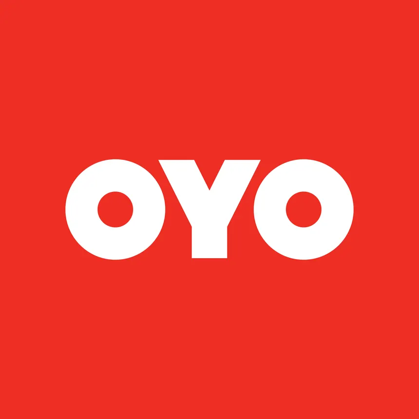
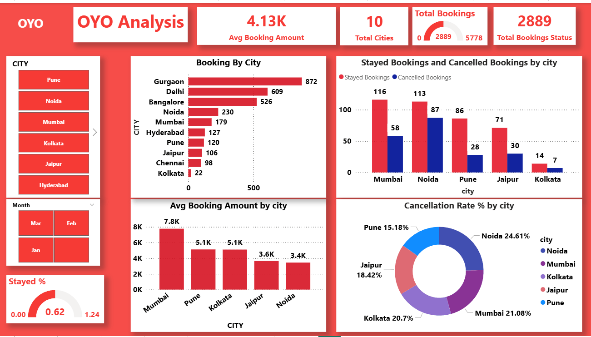
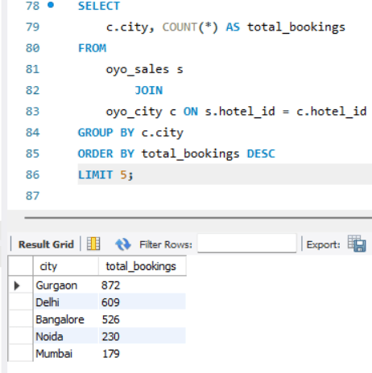
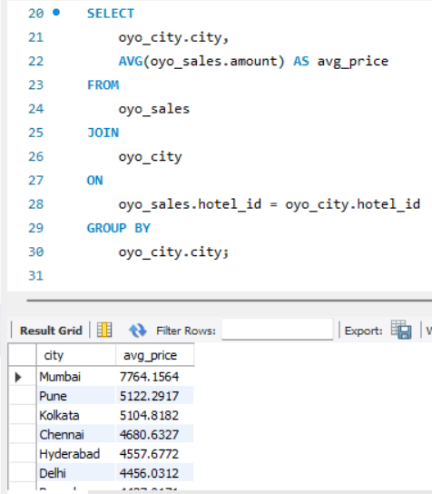
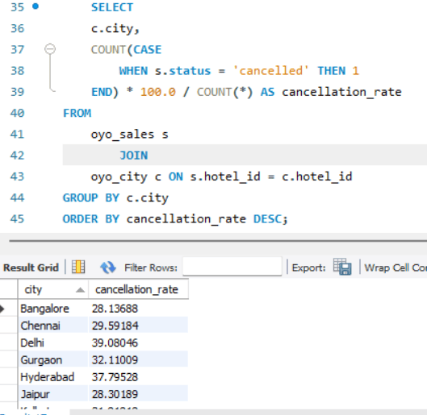
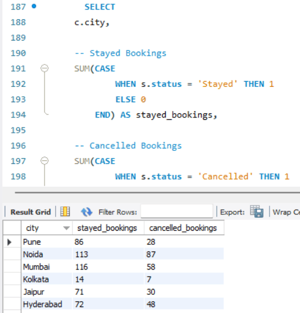

  

# -OYO-Hospitality-Analysis-Dashboard 📊
OYO Hospitality Analysis Dashboard analyzes city-wise booking trends, revenue, and cancellation behavior using SQL, Excel, and Power BI, enabling data-driven insights for improving pricing and booking performance.
______________________

## Project Overview

This project analyzes hotel booking data from OYO to understand booking trends, revenue patterns, cancellation behavior, and city-wise performance. The analysis aims to identify key factors affecting booking volume, average revenue per booking, and stay conversion rates across different locations.

Using SQL for data aggregation, Excel for data validation, and Power BI for visualization, raw booking data is transformed into actionable insights. City-level analysis highlights variations in demand and pricing, showing that high booking volumes do not always correspond to higher revenue. Cancellation trends are examined to identify revenue leakage and operational inefficiencies.

An interactive Power BI dashboard enables dynamic exploration of key metrics such as total bookings, average booking amount, stayed percentage, and cancellation rate, helping stakeholders make data-driven decisions to optimize pricing strategies and improve overall business performance.

______________________
## Business Insights
- Gurgaon has the highest booking volume, while Mumbai generates the highest average revenue per booking.
- Delhi and Noida show high cancellation rates, indicating revenue leakage.
- Pune has the lowest cancellation rate, showing strong booking quality.
- High volume does not always translate to high revenue.

  _______________________

  ## 📊 OYO Dashboard

This dashboard provides a city-wise analysis of OYO hotel bookings, highlighting booking volume, average booking amount, stayed percentage, and cancellation rates. It helps identify high-performing cities, revenue patterns, and areas of booking loss for data-driven decision-making.
____________________

## Tools Used
- SQL (MySQL)
- Power BI
- Excel

## Key KPIs
- Total Bookings
- Average Booking Amount
- Cancellation Rate %
- Stayed Percentage
- City-wise Booking Distribution
_____________________________________________
## 📊 OYO Dashboard Preview

---

## Booking By City
________

.png)

- Booking data is aggregated using SQL with a JOIN between sales and city tables and grouped by city.

- COUNT(*) is used to calculate total bookings per city and results are sorted in descending order.

- The SQL output is visualized in Power BI using a bar chart to compare booking volume across cities.

- The analysis identifies high-demand and low-demand cities for performance comparison.

  ----

  ## Average Booking Amount By City
  _________________

  

.png)

- SQL queries are used to analyze OYO hotel booking data by joining oyo_sales and oyo_city tables.

- The first analysis calculates total bookings by city, identifying high-demand locations.

- Gurgaon records the highest number of bookings, followed by Delhi and Bangalore.

- Results are visualized using a horizontal bar chart for easy comparison of city-wise booking volume.

- The second analysis computes the average booking amount per city using aggregation functions.

- Mumbai shows the highest average booking value, indicating higher revenue per booking.

- The average price comparison helps distinguish high-volume cities vs high-value cities.

- These insights support city-level demand analysis and pricing strategy decisions.

-----------------------------------------------------------------

## Cancellation Rate %
____________________________________

.png)

- SQL query calculates city-wise cancellation rate (%) using conditional aggregation on booking status.

- The calculation uses COUNT(CASE WHEN status = 'cancelled') / total bookings × 100 to derive accurate rates.

- Data is aggregated by joining oyo_sales and oyo_city tables on hotel_id.

- Results are sorted in descending order of cancellation rate to highlight risk-prone cities.

- Delhi and Gurgaon show relatively higher cancellation rates compared to other major cities.

- The pie chart visually represents the proportional contribution of each city to overall cancellations.

- Noida and Mumbai account for a significant share of cancellations, while Pune has the lowest rate.

- This analysis helps identify cities requiring stricter booking policies or improved confirmation processes.

## Stayed Booking Or Cancelled Booking
__________________________________________________________

.png)

- SQL query uses conditional aggregation (SUM + CASE) to calculate stayed bookings and cancelled bookings for each city.

- Booking status is categorized into “Stayed” and “Cancelled” to analyze customer behavior.

- Data is grouped by city after joining the oyo_sales and oyo_city tables.

- The result table clearly shows successful stays vs cancellations at a city level.

- Mumbai and Noida record the highest number of stayed bookings, indicating strong booking conversion.

- Noida also shows a relatively high number of cancellations, highlighting a potential operational issue.

- Pune and Jaipur maintain a better balance with fewer cancellations compared to stays.

- Kolkata has the lowest booking volume with minimal cancellations.

- The bar chart visually compares stayed vs cancelled bookings, enabling quick performance evaluation across cities.

- This analysis helps identify cities with higher cancellation risk and better retention performance.

  

  
